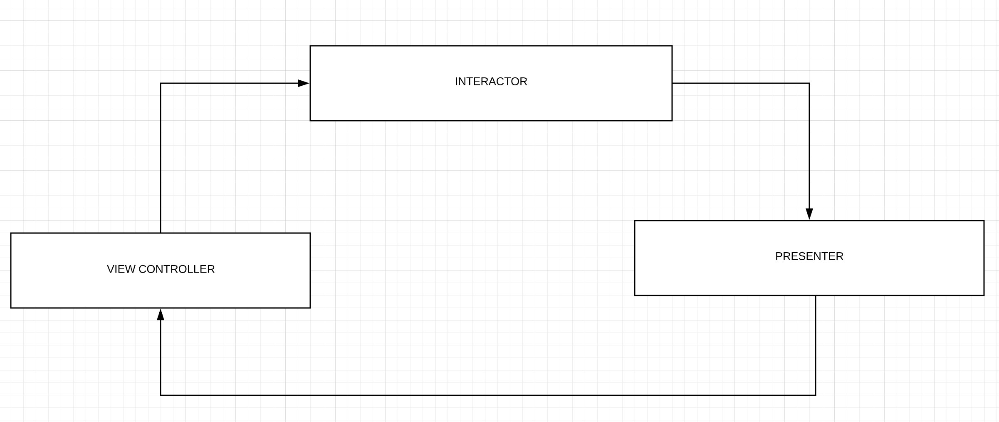

# VaionTestApp
## Note:
I can only spare a few hours to do this assignment, so, please do keep this in mind while evaluating. 
I tried to do more things in less time, instead of iron outing one thing ;)

# What's done:
1. Add server feature
2. Tests
3. Some extra setup to show where we can take this architecture.

# Architecture:

I have used Uni directional VIP (where information flows only in one direction, view-> interactor -> presenter -> view) architecture which can we can extend further to add a router and module factory.

AddServer feature is entirely using VIP. It also uses AutheticationDetailsInput view to get user input, which can be a stand-alone module but atm, I made that a just input view controller.

# Tests:
Due to to the time constraint I have added the tests for Interactor and Presenter. However, all every class is very testable as all the integration points done via protocols. You can see how easy it is to mock the dependencies.
I have added it mocks for most of the classes, which shows how easy is this to write testable code with VIP.

# Some extra setup:
To show the intentions, I have added a few additional files which are not fully implemented but there to show what we final stuff will look like.
Router (this can be used to move from one module to another)
Module factory: This can be used to create and set up a module, the code inside AddServerViewController to instantiate and setup presenter and interactor will eventually be extracted out to this factory.
